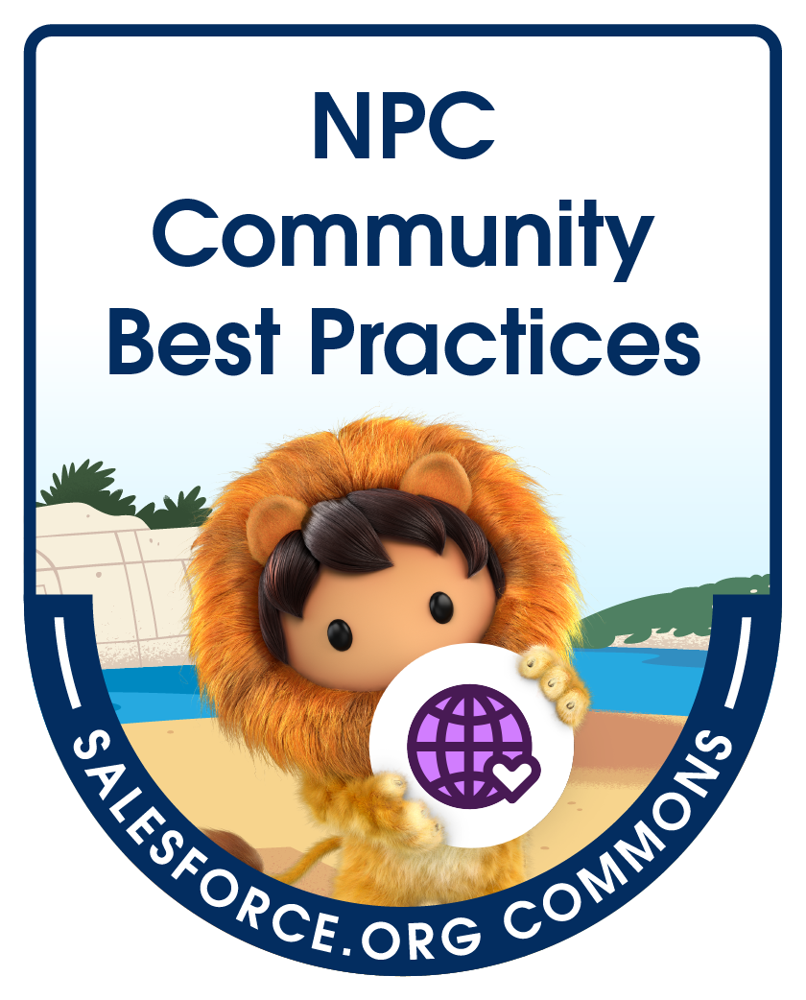

# Nonprofit Cloud Best Practices - Community Asset Hub

When the Nonprofit Success Pack (NPSP) v3 was released almost 10 years ago, it did not have many of the features and settings we are familiar with today. The large selection of default NPSP reports didn't exist, NPSP settings were not optimized, and many of the defaults we take for granted were just not there. It took a while to get community vetted best practices in place and create the NPSP we know today.

Nonprofit Cloud (NPC), Salesforce’s new product offering for nonprofits, is in a similar place. It was released in March 2023 and the fundraising component for it went live in October 2023. It does not have any community best practices or guidance like NPSP does - yet! This group has already identified content and helpful resources to be published on this site. Note that these resource pages are meant as a supplement of, and not a substituion for, the [help documentation for Nonprofit Cloud](https://help.salesforce.com/s/articleView?id=sfdo.nonprofit_cloud.htm&type=5). 

Find an issue on this site or have a question/comment? Email us at <npcbestpractices@gmail.com> or fill out our [Contact Form](https://forms.gle/FQK5DsnPLayppQXm8). Note that we cannot provide assistance configuring Nonprofit Cloud. If you have questions on Nonprofit Cloud, please post in the [Nonprofit Cloud Trailblazer Group](https://trailhead.salesforce.com/trailblazer-community/groups/0F94V000000oRAfSAM).

# Project History
The Nonprofit Cloud Best Practices Group (NPC BP) is a project of [Salesforce's Commons](https://sfdo-community-sprints.github.io/). The Commons brings together volunteers from the Salesforce nonprofit community to build free resources for nonprofits to use. The NPC BP's first meeting was in October 2023, at the Chicago Commons Sprint. Two dozen participants kicked the project off that week and bi-weekly meetings for both the main group and feature-focused subgroups have been running since then. 

NPC BP Sprint Group - Chicago, November 2024

NPC BP Sprint Group - Virtual, September 2024

